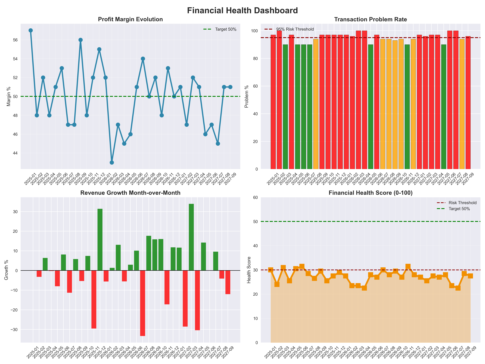
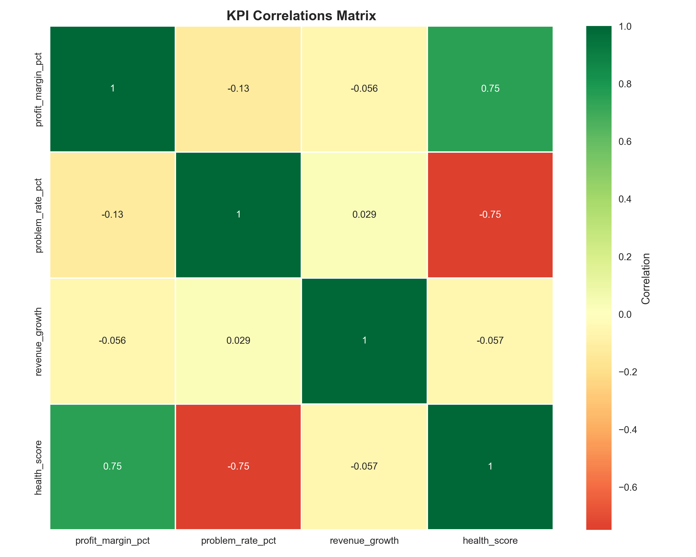

# Financial Health Analysis

Analysis of transaction data revealing operational crisis: **97% problem rate** driving **Health Score 24-31/100**.

## Key Metrics
| Metric | Value | Status |
|--------|-------|--------|
| Health Score | 24-31/100 | Critical |
| Problem Rate | 95-100% | Crisis |
| Profit Margin | 43-57% | Volatile |
| Revenue Growth | -8% to +6% | Unstable |

## Visualizations
### Dashboard

### KPI Correlations

## Methodology
- **Composite KPI**: `Health Score = (1-problem_rate)*50 + margin*0.5`
- Correlation analysis identifying **problem_rate** as primary driver
- Executive dashboard for trend monitoring

## Technology
Python | Pandas | Matplotlib | Seaborn

## Business Recommendation
**Priority**: Deploy fraud detection model targeting problem_rate <80%.
**Expected impact**: Health Score +15-20 points.

## Repository Contents
├── data_analysis.py        # Analysis pipeline   
├── dashboard.png, correlations.png # Visualizations  
├── accounting_data.csv     # Dataset   
└── README.md               # This document

**Wojciech Lenart**  
Junior Data Analyst  
[LinkedIn](https://www.linkedin.com/in/wojciechlenart) | wojteklenart532@gmail.com  
[GitHub Portfolio](https://github.com/wojtek532?tab=repositories)
